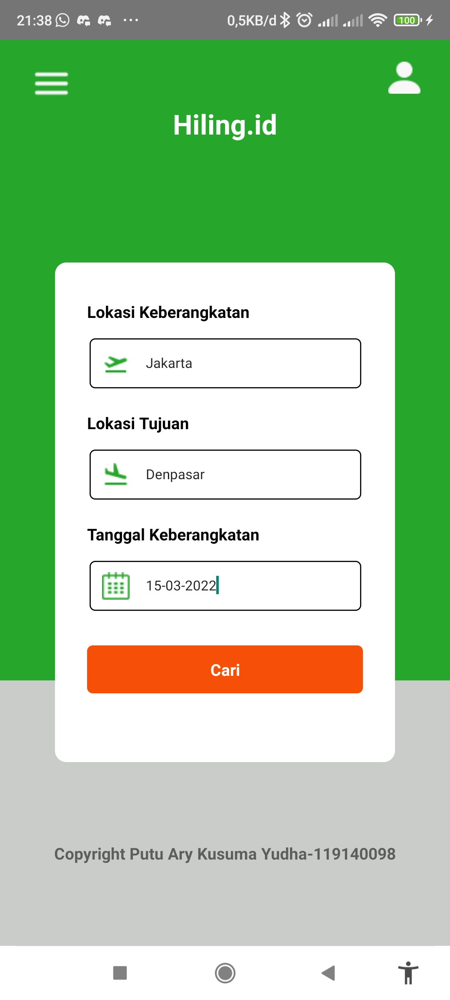
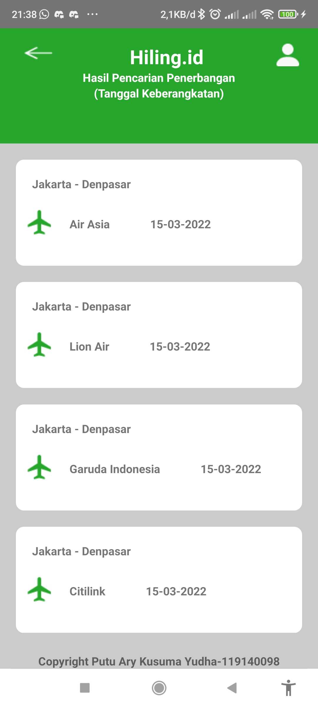

# Tugas 3 `PAM`
Berikut merupakan `tampilan awal` dari aplikasi yang dibuat

- Tampilan di atas digunakan untuk mengajukan atau mengubah laporan/komentar.
- Perhatikan label dari field pada form berada di dalam field (tidak di luar)
- Apek yang dilaporkan ditampilkan dalam bentuk `select`

- Bagian ini menampilkan laporan/komentar. Bagian `datetime` harus ada. Tanda `kuote` tidak harus ada
- Perhatikan label dari field pada form berada di dalam field (tidak di luar)

### Putu Ary Kusuma Yudha (119140098) - PAM RD :honeybee:
